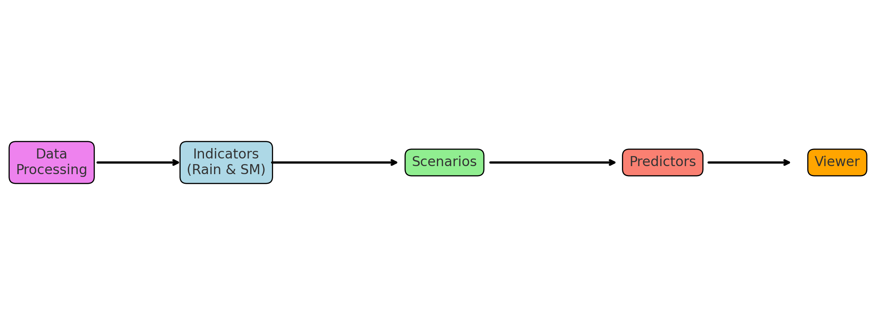
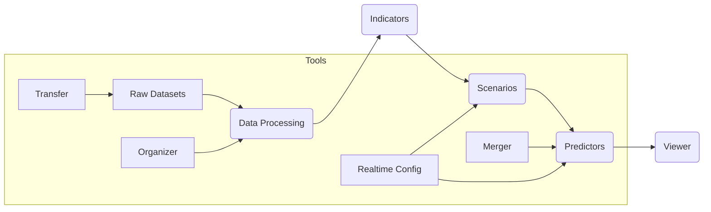

# SLIPER – Soil Landslide Information and Prediction & Early Response

**Version 3.1.0 – October 2025**  
SLIPER is a modular open-source toolkit developed by **CIMA Research Foundation** and **ARPAL Liguria** for **landslide forecasting, early warning, and risk assessment**. It integrates **rainfall, soil moisture, soil slips, indicators, scenarios, and predictors** into a fully automated end-to-end workflow for environmental monitoring and forecasting systems.

---

## **Workflow Overview**

SLIPER operates through a structured multi-stage processing chain, enabling the transformation of raw geospatial and observational data into operational prediction products.

1. **Data Processing** – Preprocessing of rainfall, soil moisture, and soil slips datasets.
2. **Indicators** – Computation of rainfall and soil moisture indicators over time.
3. **Scenarios** – Integration of indicators and observed soil slips to define hazard scenarios.
4. **Predictors** – Generation of predictors for nowcasting and forecasting applications.
5. **Viewer** – Visualization of predictors, time-series trends, and validation metrics.



---

## **Modules and Documentation**

All SLIPER modules are independent yet interoperable. Detailed documentation for each component is available under the `/docs` directory.

### 1. **Data Processing**
Modules responsible for converting raw environmental inputs into harmonized datasets.
- [Rainfall Data Processing](docs/docs_app_data_rain.md)
- [Soil Moisture Data Processing](docs/docs_app_data_sm.md)
- [Soil Slips Data Processing](docs/docs_app_data_slips.md)

### 2. **Indicators**
Indicator modules compute time-based and cumulative statistics from processed datasets.
- [Rainfall Indicators](docs/docs_app_indicators_rain.md)
- [Soil Moisture Indicators](docs/docs_app_indicators_sm.md)

### 3. **Scenarios and Predictors**
Modules that combine multiple sources and produce predictors for landslide hazard evaluation.
- [Scenarios Generation](docs/docs_app_scenarios.md)
- [Predictors Computation](docs/docs_app_predictors.md)

### 4. **Visualization**
Interactive tools for analysis, validation, and visual communication.
- [Viewer Tool](docs/docs_app_viewer.md)

### 5. **Tools**
Utilities that support data handling, configuration management, and operational automation.
- [Merger](docs/docs_tools_merger.md)
- [Organizer](docs/docs_tools_organizer.md)
- [Transfer](docs/docs_tools_transfer.md)
- [Realtime Configuration Scripts](docs/docs_tools_runner.md)

### 6. **Workflow Description**
- [SLIPER Workflow Overview](docs/docs_sliper_workflows.md)

---

## **Installation and Setup**

### Clone from GitHub
```bash
git clone https://github.com/c-hydro/sliper.git
cd sliper
```

### Conda Environment (recommended)
```bash
conda create -n sliper_env python=3.9
conda activate sliper_env
pip install -r requirements.txt
```

This will install all dependencies required to execute SLIPER modules.

### Local Setup Scripts
The repository also provides helper scripts for initializing local runners and configurations:
```bash
bash setup_sliper_system_runner_data.sh
```
These scripts simplify environment setup and data directory structuring.

---

## **Execution**

SLIPER applications can be run as standalone modules or integrated pipelines.

### Python Modules
Each Python module can be executed as follows:
```bash
python sliper_<module>_main.py -settings_file configuration.json -time "YYYY-MM-DD HH:MM"
```
Example:
```bash
python sliper_data_rain_main.py -settings_file sliper_config_data_rain.json -time "2025-10-01 00:00"
```

### Shell Tools
Shell utilities simplify file management and real-time operations.
```bash
bash sliper_tools_organizer_sm_file2folders.sh [SRC] [DST]
bash sliper_tools_scenarios_configuration_realtime.sh
bash sliper_tools_predictors_configuration_realtime.sh
```

---

## **Inputs and Outputs**

### Inputs
- Rainfall grids (GeoTIFF)
- Soil moisture data (NetCDF)
- Soil slips data (CSV)
- Configuration JSONs (model parameters, thresholds, and IO paths)

### Outputs
- Processed data (GeoTIFF)
- Indicators, scenarios, and predictors (CSV)
- Visualization plots (JPEG, PNG)
- Logs and diagnostic files

---

## **Extended Workflow (including Tools)**



The **Tools** modules extend the workflow to support real-time operations, file synchronization, and automated configuration updates.

---

## **Key Features**

- Modular and scalable architecture
- Fully configurable through JSON settings
- Compatible with gridded and point-based datasets
- End-to-end integration from data ingestion to prediction visualization
- Designed for operational landslide forecasting systems

---

## **Repository Structure**

```
sliper/
├── docs/                       # Documentation files
├── package_sliper/             # Python package code
├── notebook/                   # Example notebooks
├── setup_sliper_system_runner_data.sh
├── notes_sliper_system_runner_data.txt
├── README.md
├── LICENSE.md
├── CHANGELOG.md
├── AUTHORS.md
├── CODEOWNERS.md
```

---

## **Additional References**

- [LICENSE.md](LICENSE.md): License terms and conditions
- [CHANGELOG.md](CHANGELOG.md): Release notes and version history
- [AUTHORS.md](AUTHORS.md): Contributors and collaborators
- [CODEOWNERS.md](CODEOWNERS.md): Maintainers responsible for repository modules

---

## **Contacts**

For inquiries, collaboration, or bug reports:
- **Fabio Delogu** – [fabio.delogu@cimafoundation.org](mailto:fabio.delogu@cimafoundation.org)
- CIMA Research Foundation – [https://www.cimafoundation.org](https://www.cimafoundation.org)

---

© 2025 CIMA Research Foundation and ARPAL Liguria. All rights reserved.  
SLIPER is distributed under the terms of the [LICENSE.md](LICENSE.md).

