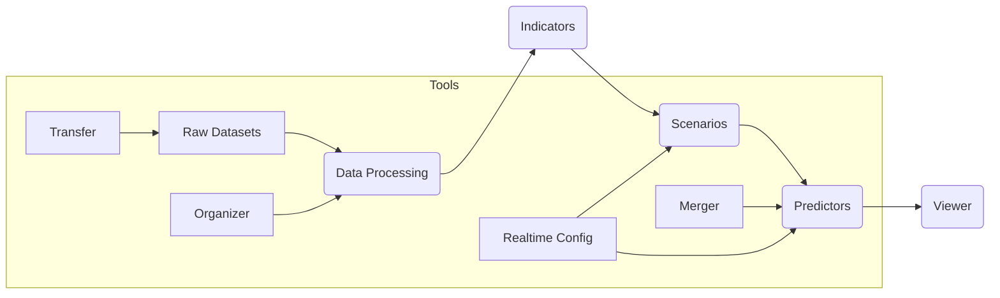

# SLIPER – Soil Landslide Information and Prediction & Early Response

SLIPER is a modular toolkit developed by **CIMA Research Foundation** and **ARPAL Liguria** for **landslide forecasting and risk assessment**. It integrates **rainfall, soil moisture, soil slips, indicators, scenarios, and predictors** into a full end-to-end workflow.

---

## **Workflow Overview**

This section introduces the main processing flow. SLIPER works through a multi-stage pipeline:

1. **Data Processing** – Preprocessing of rainfall, soil moisture, and soil slips.
2. **Indicators** – Generation of rainfall and soil moisture indicators.
3. **Scenarios** – Combination of indicators and observed soil slips.
4. **Predictors** – Computation of predictors for landslide forecasting.
5. **Viewer** – Visualization of predictors and related time-series.


---

## **Modules and Documentation**

This section lists and links all module-specific documentation for detailed reference.

### 1. **Data Processing**
These modules convert raw input data into standardized, ready-to-use datasets.
- [Rainfall Data Processing](docs/docs_app_data_rain.md)
- [Soil Moisture Data Processing](docs/docs_app_data_sm.md)
- [Soil Slips Data Processing](docs/docs_app_data_slips.md)

### 2. **Indicators**
Indicator modules summarize processed data into metrics that can be analyzed.
- [Rainfall Indicators](docs/docs_app_indicators_rain.md)
- [Soil Moisture Indicators](docs/docs_app_indicators_sm.md)

### 3. **Scenarios and Predictors**
These modules integrate data sources and generate predictors.
- [Scenarios Generation](docs/docs_app_scenarios.md)
- [Predictors Computation](docs/docs_app_predictors.md)

### 4. **Visualization**
This module creates time-series plots for analysis.
- [Viewer Tool](docs/docs_app_viewer.md)

### 5. **Tools**
Supporting utilities to merge, organize, and transfer data, as well as set up configurations.
- [Merger](docs/docs_tools_merger.md)
- [Organizer](docs/docs_tools_organizer.md)
- [Transfer](docs/docs_tools_transfer.md)
- [Realtime Config Scripts](docs/docs_tools_runner.md)

### 6. **Workflow Description**
An overview of the SLIPER pipeline in a single document.
- [SLIPER Workflow Overview](docs/docs_sliper_workflows.md)

---

## **Installation and Setup**

This section explains how to set up SLIPER in your environment.

### Download from GitHub
You can clone the repository using:
```bash
git clone https://github.com/your-org/sliper.git
cd sliper
```

### Conda Environment
A recommended way to set up dependencies is to use **conda**:
```bash
conda create -n sliper_env python=3.8
conda activate sliper_env
pip install -r requirements.txt
```

This will ensure all Python packages required by SLIPER are installed in an isolated environment.

---

## **Execution**

This section describes how to run SLIPER applications. Python modules process data and generate outputs, while shell tools assist in organizing files and updating configurations.

### Python Modules
Use the following command to run any SLIPER module (replace `<module>` with the module name):
```bash
python sliper_<module>_main.py   -settings_file configuration.json   -time "YYYY-MM-DD HH:MM"
```

### Shell Tools
Shell scripts automate supporting tasks such as organizing files and preparing configurations.
```bash
bash sliper_tools_organizer_sm_file2folders.sh [SRC] [DST]
bash sliper_tools_scenarios_configuration_realtime.sh
bash sliper_tools_predictors_configuration_realtime.sh
```

---

## **Inputs and Outputs**

This section describes the types of data SLIPER works with.

### **Inputs**
- Rainfall grids (GeoTIFF)
- Soil moisture data (NetCDF)
- Soil slips data (CSV)
- Configuration JSON files (paths, thresholds, parameters)

### **Outputs**
- GeoTIFF files (processed data)
- CSV files (indicators, scenarios, predictors)
- JPEG plots (predictors visualization)
- Logs and intermediate workspace files

---

## **Extended Workflow (including Tools)**



This diagram includes **support tools** for organizing, transferring, merging data, and updating configurations in real-time.

---

## **Key Features**

- Multi-source data integration
- Configurable via JSON
- Outputs for operational risk forecasting
- Visualization support

---

## **Additional References**
These files provide additional context about the SLIPER package:
- [LICENSE](LICENSE): Licensing terms and conditions
- [CHANGELOG](CHANGELOG): Summary of changes and release history
- [AUTHORS](AUTHORS): List of contributors and authors
- [CODEOWNERS](CODEOWNERS): Maintainers responsible for the repository

---

## **Contacts**

For inquiries or support:
- Fabio Delogu – fabio.delogu@cimafoundation.org
